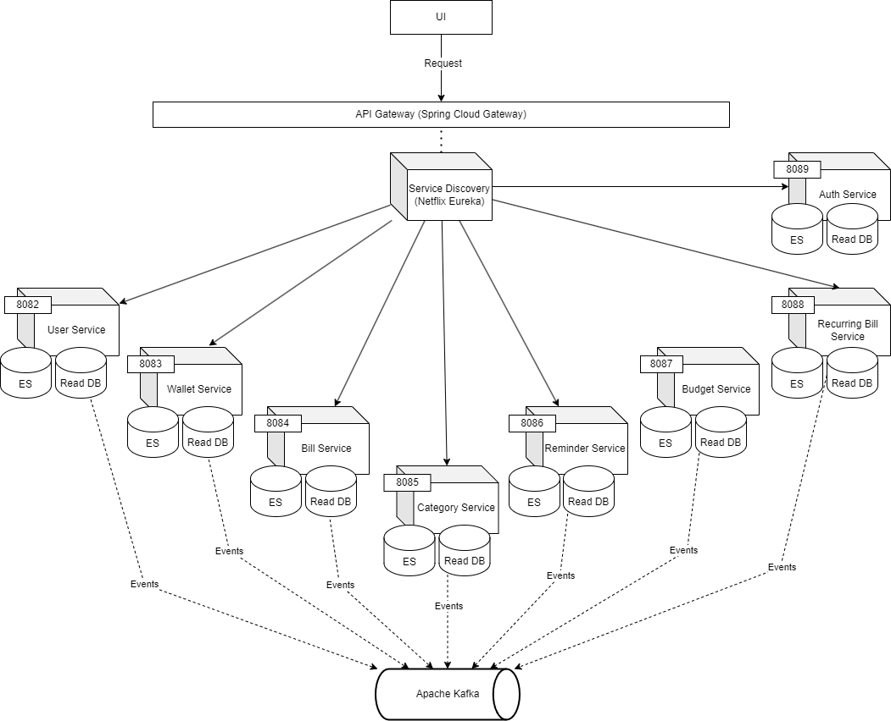

## Wise-wallet backend
An expense management app, that can track your wallet health,
expenses and incomes. This project contains a Rest API created 
with Spring Boot 3 and Java 21, following event driven 
architecture with microservices.

The main purpose of this project is to study the various
technologies involving microservices and event sourcing.
During the development, i learned many features about Java
and Spring framework, like Java reflection, dependency injection
 with spring, swagger documentation, maven multi-modules and more.

### Content
- [1. Key features](#1-key-features)
- [2. Technical Guide](#2-technical-guide)
  - [2.1 Clean Architecture](#21-clean-architecture)
  - [2.2 Event Sourcing](#22-event-sourcing)
  - [2.3 Microservices](#23-microservices)
  - [2.4 Command and Query Responsibility Segregation (CQRS)](#24-command-and-query-responsibility-segregation-cqrs)
- [2. Class diagram](#2-class-diagram)
- [3. Architecture](#3-system-architecture)

### 1. Key features
- Microservices and event sourcing;
- Command and Query Responsibility Segregation (CQRS);
- MongoDB as read database;
- PostgreSQL as Event Store;
- Apache Kafka as microservice communication;
- Domain Driven Design (DDD) concepts and Clean Architecture.

### 2. Technical guide
### 2.1 Clean Architecture

Clean Architecture is a software architecture proposed by Robert C. Martin.
The main purpose of this architecture is to protect the business logic
of the software from external dependencies like database, frontend UI,
frameworks and libraries. The business logic must be decoupled from external dependencies, and it
can bring several benefits.

External layers should depends from internal layers, but internal layers
should not depends from externals layers or even knows if them exists.
For example, the use cases (or application layer) should know that the entities (or core/domain)
exists and depends from it, but the entities layer doesn't even know that 
the use cases layer exists. The dependency points inward to the center of the circle,
but not outwards.

### 2.2 Event Sourcing

Event is something that happened in the past. Event sourcing is a form
to store theses and handle it. It's a way to update the system's current state
based on a set of occurred events. Generally, normal systems store just
the current state of entities. Systems implemented with event sourcing stores
the entire lifeline of an entity, since its creation. In event sourcing,
versions of an entity is important to identify all the entity states.

In event sourcing, events are stored in a proper local called event store.
An event store is a database focused on storing and managing events.
Normally, when querying an entity from an event store, we query all of
that entity events, but it can have many issues if we have a big bunch of events.
Snapshots is a concept in event store that acts like an event checkpoint, and it
can be created at every nth event. A snapshot stores a specific state of an entity. 
Querying from a snapshot can be more performatic than querying all the entity events.

### 2.3 Microservices

Microservices is an architecture that structures the application in several services.
Instead of building a monolithic system, microservices separates the system
into multiple smaller projects called services. When dealing with big systems, implementing
microservices would be a wise choice, because of it's decoupled characteristics.

A monolithic can be a good choice when dealing with small systems, but when
that system grows, it will become more complicated to maintain and anti-performatic.

### 2.4 Command and Query Responsibility Segregation (CQRS)

Different from CRUD systems, CQRS separates query operations from
operations that change the state of the application (commands).
Instead of using just one database for both operations, in CQRS we
can separate it into write database and read database.

### 2. Class diagram

### 3. System architecture

